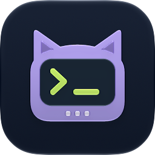
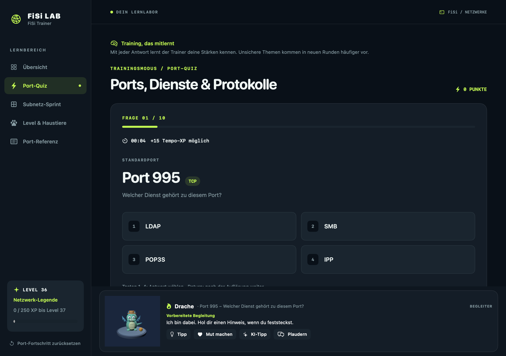
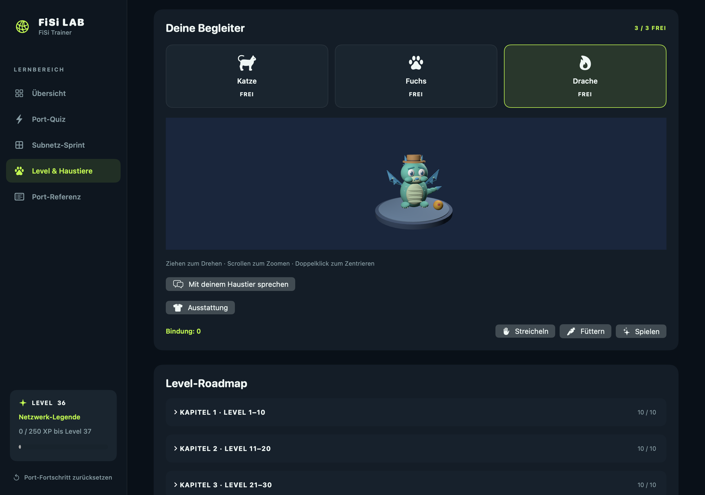

  

<h1 align="center">FiSi Trainer</h1>

Ports und IPv4-Subnetze üben – mit kurzen Runden, sichtbarem Fortschritt und einem 3D-Begleiter.

  
  
  
  

*Ansichten mit Demo-Spielständen.*

FiSi Trainer ist eine native macOS-App zur eigenständigen Vorbereitung auf Fachinformatik-Themen. Sie läuft ohne Konto und speichert Lernstand und Einstellungen lokal. Die Prüfungsaufgaben und Auswertungen funktionieren ohne KI.

## Herunterladen und starten

1. Auf der Seite [**Neueste Version herunterladen**](https://github.com/MagicalWig34653/fisi-trainer/releases/latest) die DMG laden, zum Beispiel `FiSiTrainer-v1.0.1-macOS-universal.dmg`.
2. DMG öffnen und im Finder-Fenster **FiSiTrainer** auf die Verknüpfung **Programme** ziehen. Danach die DMG auswerfen und die App aus Programme starten. Benötigt **macOS 14 oder neuer**.
3. Die gleichnamige `.sha256`-Datei im Release enthält die Prüfsumme der DMG.

Die CI führt bei Pushes und Pull Requests die macOS-Tests aus. Beim Veröffentlichen eines GitHub Releases baut der Release-Workflow automatisch die Universal-App und hängt DMG und SHA-256-Datei an die Version an.

Die Release-App ist ad hoc signiert, **nicht** mit einer Developer ID signiert und **nicht** von Apple notarisiert. macOS kann deshalb beim ersten Öffnen warnen. Wer die Datei aus diesem Repository geladen hat und ihr vertraut, kann nach dem ersten Öffnungsversuch unter **Systemeinstellungen → Datenschutz & Sicherheit → Dennoch öffnen** fortfahren. [Apple erklärt diesen Schritt](https://support.apple.com/de-de/102445).

Alternativ lässt sich die App [aus dem Quellcode bauen](Documentation/DEVELOPMENT.md).

## Was du üben kannst

- **Port-Quiz:** 40 Dienste, Fragen von Dienst zu Port und umgekehrt sowie TCP/UDP. Zehn Fragen pro Runde, Erklärung nach jeder Antwort.
- **Subnetz-Sprint:** IPv4-Präfixe von `/16` bis `/30`, Subnetzmasken und nutzbare Hostadressen. Ebenfalls zehn Fragen pro Runde.
- **Adaptives Training:** Fehler und die letzten Antworten beeinflussen die Themenauswahl neuer Runden. Sichere und neue Themen bleiben im Mix.
- **Tempo-XP ohne Zeitdruck:** Beide Spiele messen die Antwortzeit für einen Bonus. Es gibt kein Zeitlimit.
- **Tastatursteuerung:** **1–4** wählt Antworten, **Return** führt weiter.

Beide Spiele speichern ihre Runden und XP lokal. Die gemeinsame Belohnungs-Roadmap zeigt **100 Level** mit Titeln, Abzeichen, drei freischaltbaren Haustieren und acht Ausstattungsstücken.

Katze, Fuchs und Drache bestehen aus nativen SceneKit-Geometrien. Du kannst sie drehen, streicheln, füttern und mit ihnen spielen. Jedes Tier bekommt eigenes 3D-Futter; Kleidung und Spielzeug lassen sich pro Tier auswählen. Der freigeschaltete Begleiter erscheint auch während der Übungen und gibt vorbereitete Tipps.

## Optionaler lokaler KI-Chat

**Plaudern** und **KI-Tipp** verwenden ausschließlich Apples lokales Foundation-Models-Sprachmodell. Dafür sind **macOS 26 oder neuer**, ein unterstützter Mac und aktivierte, verfügbare **Apple Intelligence** nötig. Die App zeigt an, wenn das Modell nicht verfügbar ist; vorbereitete Tipps bleiben nutzbar. Einzelne Pet-Antworten lassen sich auf Wunsch mit der macOS-Sprachausgabe vorlesen.

KI-Anfragen starten nur nach einem Klick und werden nicht an einen Cloud-Dienst der App gesendet. Chatnachrichten werden nicht dauerhaft gespeichert. Vor Abgabe einer Aufgabe erhält das Modell nur einen Hinweis, danach auch die Erklärung. KI-Antworten können Fehler enthalten; die Spielauswertung bleibt regelbasiert.

## Mitmachen und Lizenz

Fehlerberichte und Beiträge sind willkommen. Der [Beitragsleitfaden](CONTRIBUTING.md) erklärt den lokalen Build und die Tests; [Entwicklungsdetails](Documentation/DEVELOPMENT.md) beschreiben Aufbau und Spielregeln.

Der Quellcode steht unter [**AGPL-3.0-only**](LICENSE). FiSi Trainer ist ein unabhängiges Lernprojekt und kein offizielles Angebot der IHK oder einer Prüfungseinrichtung.
